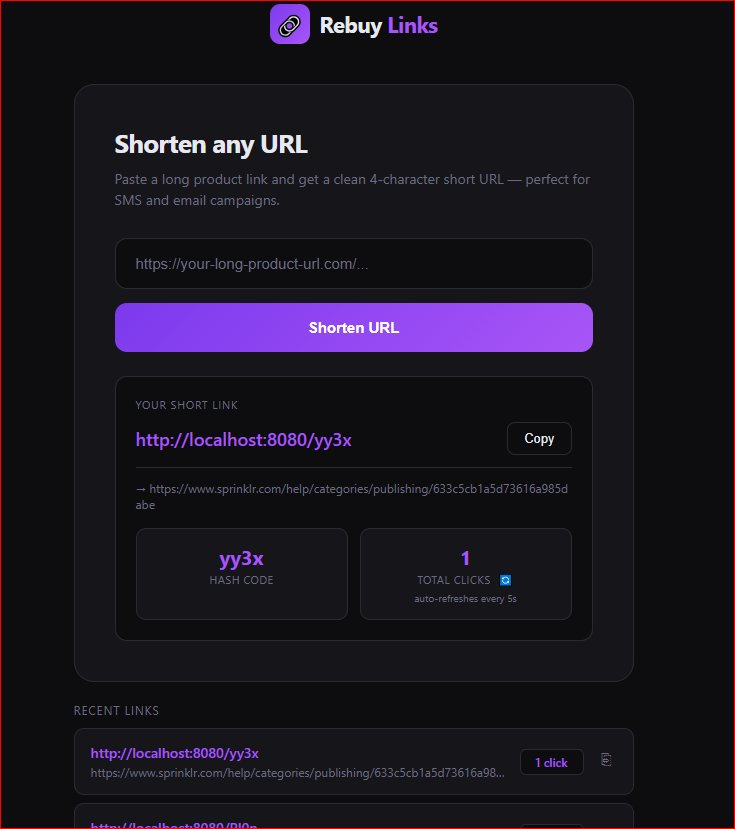
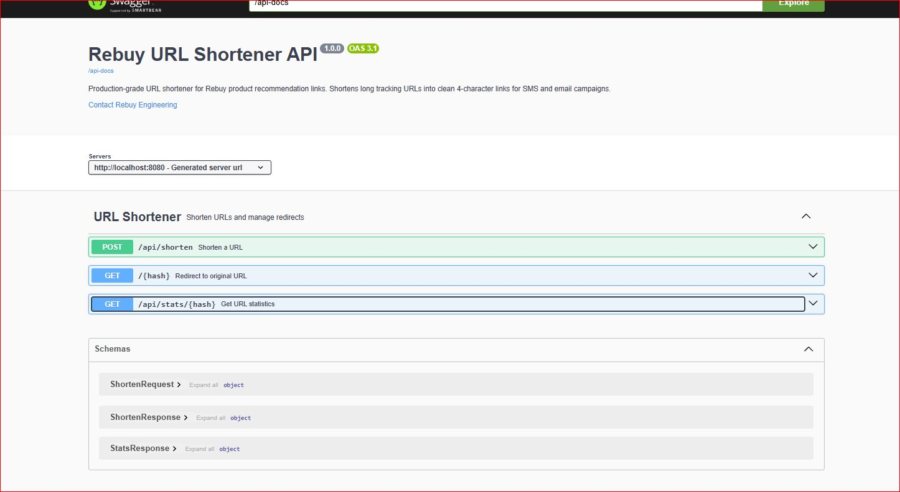
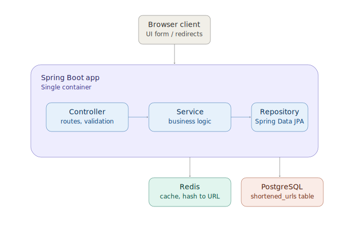
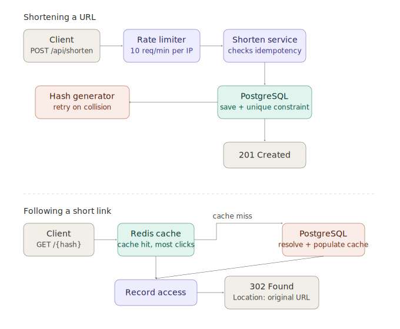

# Rebuy Links — URL Shortener

A production-grade URL shortener built for Rebuy's product recommendation
link campaigns. Shortens long tracking URLs into clean 4-character links — designed to enter the market quickly while
making deliberate, defensible engineering tradeoffs along the way.



---

## Setup Instructions

### Prerequisites
- Docker Desktop (running)
- Java 21 (only needed for running tests outside Docker)
- Maven (only needed for `mvn test` outside Docker)

### Quick Start — One Command

```bash
cp .env.example .env
docker compose up --build
```

That's it. Postgres, Redis, pgAdmin, and the Spring Boot app all start
automatically. Flyway runs the database migrations on startup — no manual
SQL setup is needed.

### What's Running After Startup

| Service | URL | Credentials |
|---|---|---|
| Frontend (shorten form) | http://localhost:8080 | — |
| Swagger UI | http://localhost:8080/swagger-ui.html | — |
| Health check | http://localhost:8080/actuator/health | — |
| pgAdmin (DB UI) | http://localhost:5050 | `admin@rebuy.com` / `admin123` |

**Connecting pgAdmin to Postgres** (one-time setup after pgAdmin opens):
```
Host:     postgres
Port:     5432
Database: urlshortener
Username: urlshortener
Password: urlshortener
```

### Environment Variables / Secrets

Database and pgAdmin credentials are read from a `.env` file (gitignored,
never committed) sitting next to `docker-compose.yml`. `.env.example` is
the committed template — copy it before first run (see Quick Start above).

| Variable | Default | Description |
|---|---|---|
| `DB_HOST` | localhost | PostgreSQL host (overridden to `postgres` inside Docker) |
| `DB_PORT` | 5432 | PostgreSQL port |
| `DB_NAME` | urlshortener | Database name |
| `DB_USER` | urlshortener | Database user |
| `DB_PASSWORD` | urlshortener | Database password |
| `REDIS_HOST` | localhost | Redis host (overridden to `redis` inside Docker) |
| `REDIS_PORT` | 6379 | Redis port |
| `APP_BASE_URL` | http://localhost:8080 | Base URL used when building short URLs |
| `CACHE_TTL_MINUTES` | 60 | Redis cache TTL for resolved hashes |

### Stopping / Resetting

```bash
docker compose down          # stop containers, KEEP all data
docker compose down -v       # stop containers, WIPE all data + volumes
```

Postgres and Redis data persist across normal restarts via Docker volumes
— only `-v` deletes them.

### Running Tests

```bash
mvn test
```

Tests use an in-memory H2 database and Spring's simple in-memory cache —
no Docker or external services required. This is configured via a
separate `src/test/resources/application.yaml` that Spring Boot
automatically picks up on the test classpath.

```
src/test/java/.../service/HashGeneratorTest.java        — unit tests
src/test/java/.../service/UrlShortenerServiceTest.java  — unit tests (Mockito)
src/test/java/.../controller/UrlShortenerControllerTest.java — integration (MockMvc + H2)
```

---

## API Reference

### Shorten a URL
```
POST /api/shorten
Content-Type: application/json

{ "url": "https://your-long-url.com/..." }
```
Response (`201 Created`):
```json
{
  "originalUrl": "https://your-long-url.com/...",
  "shortUrl": "http://localhost:8080/aB3x",
  "hash": "aB3x",
  "createdAt": "2026-06-18T09:00:00Z"
}
```
Validation: URL must start with `http://` or `https://`, max 2048 characters.
Rate limited to 10 requests/minute per IP.

### Follow a Short Link
```
GET /{hash}
→ 302 Found
  Location: <original URL>
```
This endpoint cannot be meaningfully tested via Swagger's "Try it out" —
browsers block the cross-origin fetch to the redirect destination after
following the 302. Test with a real browser navigation, or:
```bash
curl -i http://localhost:8080/{hash}
```

### Get Click Stats
```
GET /api/stats/{hash}
```
Response (`200 OK`):
```json
{
  "hash": "aB3x",
  "originalUrl": "https://your-long-url.com/...",
  "shortUrl": "http://localhost:8080/aB3x",
  "accessCount": 47293,
  "createdAt": "2026-06-18T09:00:00Z",
  "lastAccessedAt": "2026-06-18T14:23:00Z"
}
```

### Error Responses
All errors return a consistent shape:
```json
{ "error": "NOT_FOUND", "message": "No URL found for hash: zzzz", "status": 404 }
```

| Status | Error Code | Cause |
|---|---|---|
| 400 | `VALIDATION_ERROR` | Malformed request body, blank/invalid URL |
| 400 | `BAD_REQUEST` | Business rule failure (e.g. hash generation exhausted) |
| 404 | `NOT_FOUND` | Hash does not exist |
| 429 | `TOO_MANY_REQUESTS` | Rate limit exceeded for this IP |
| 500 | `INTERNAL_ERROR` | Unexpected server error, or any unmatched/invalid path (logged with full stack trace) |

Interactive docs (Swagger UI) live at `/swagger-ui.html`, generated
automatically from controller annotations via springdoc-openapi. The
frontend's static file-serving route is excluded from the generated docs
via `@Hidden` since it isn't a real API operation.



---

## High-Level Architecture



---

## Request Flow



---

## Tech Stack

| Layer | Technology | Why |
|---|---|---|
| Backend | Spring Boot 3.5.15, Java 21 | LTS Java for stability; modern Spring Boot |
| Database | PostgreSQL 16 | Reliable relational store with proper indexing |
| Cache | Redis 7 | Sub-millisecond redirect lookups on the hot path |
| Migrations | Flyway | Schema as code — every environment gets identical schema |
| API Docs | Swagger UI (springdoc-openapi) | Zero-setup interactive testing |
| Rate Limiting | Bucket4j | Token bucket algorithm, per-IP abuse prevention |
| DB Admin UI | pgAdmin | Visual inspection of stored data |
| Container | Docker + Docker Compose | One-command setup for the full stack |
| Logging | SLF4J + Logback | Structured logging across all services |

**A note on Java version:** local development machines may have Java 25
installed, but the project deliberately targets and compiles against
**Java 21 (LTS)** in both `pom.xml` and the Docker image. The codebase uses
no Java 25-specific language features, so this has zero effect on
behavior — it simply avoids depending on a very new, non-LTS release for
a production deliverable. IntelliJ's Module SDK and Project Bytecode
Version must both be set to 21 to match.

---

## Key Technical Decisions

### 1. Hash Generation — Random Base62
4 characters from `[a-zA-Z0-9]` = 62⁴ = **14,776,336 unique combinations**.

**Why Base62 and not special characters:** URL special characters
(`?`, `#`, `&`, `/`, `%`) have reserved meaning in browsers — for example,
`?` starts a query string, so the browser never even sends the full path
to the server if a hash contained one. Base62 is 100% URL-safe with zero
encoding needed.

**Why random over a sequential counter:** sequential IDs (`0001`, `0002`,
`0003`) are guessable — anyone can enumerate every link on the platform
by incrementing a number. Random generation prevents URL enumeration and
protects confidential campaign click data.

**Collision handling:** a retry loop (max `AppConstants.MAX_HASH_GENERATION_RETRIES`
= 10 attempts) regenerates the hash if `existsByHash()` detects a
collision. At this scale, collision probability per attempt stays low and
the loop resolves almost instantly.

**Final protection against collisions:** the `hash` column also has a
database-level `UNIQUE` constraint (`idx_hash` in the Flyway migration).
Even if the application-level check raced with a concurrent insert under
high concurrency, the database itself rejects a duplicate insert with a
constraint violation rather than silently overwriting another URL's
mapping — application logic is never solely trusted for uniqueness.

### 2. Redirect Strategy — 302 Not 301
- **301 (Permanent):** browsers cache the destination forever after the
  first visit. If a link is ever updated or needs analytics, browsers
  that already visited skip the server entirely on future clicks.
- **302 (Temporary):** the browser asks the server on every click —
  every click can be counted, and the destination can be changed later.

For a URL shortener where click analytics is a core feature, 302 is the
only correct choice.

### 3. Redis Cache on the Redirect Path
The redirect endpoint (`GET /{hash}`) is the hottest endpoint by far — a
single campaign email to 100,000 customers creates 100,000 near-simultaneous
hits on one hash. Without caching that's 100,000 database queries in
minutes; with Redis, one DB read ever per hash, and every subsequent hit
served from memory in well under a millisecond.

**TTL: 60 minutes.** Trade-off: a stale destination could theoretically be
served for up to 60 minutes after an update. Acceptable for this MVP since
there is no update functionality yet and destinations are immutable once
created.

### 4. Idempotency
Submitting the same URL twice returns the **existing** hash rather than
creating a duplicate. Marketing teams and automated systems often submit
the same URL multiple times — without idempotency, the same destination
would accumulate many different short links, fragmenting click analytics
across them.

### 5. Per-IP Rate Limiting
`POST /api/shorten` is rate limited to 10 requests/minute per IP via
Bucket4j's token bucket algorithm, protecting against scripted abuse that
could exhaust the finite hash space.

**The redirect endpoint is deliberately NOT rate limited.** Legitimate
viral traffic — many people behind a shared office NAT clicking a link
from the same campaign — could easily exceed 10 req/min from one apparent
IP. Blocking real customers from following a link they were sent would
defeat the product's purpose. Rate limiting only applies where abuse risk
(hash exhaustion) outweighs the cost of false positives.

### 6. Flyway Database Migrations
Schema changes are versioned SQL files (`V1__create_shortened_urls_table.sql`,
`V2__fix_hash_column_type.sql`). Every environment gets the exact same
schema automatically on startup. Once a migration has run anywhere, it is
**never edited** — further changes go in new versioned migrations, which
is why the column-type fix is `V2` rather than a rewrite of `V1`.

---

## Logging

Uses SLF4J with Logback (Spring Boot's default logging backend). All
services and controllers use `@Slf4j` with deliberately chosen levels:

```
TRACE → extremely high-frequency, low-value detail (every hash candidate
         generated, every client-IP resolution). Off by default.
DEBUG → routine operational detail ("URL already exists", stats lookups,
         access-count increments).
INFO  → meaningful business events ("Created short URL", successful
         redirects, incoming shorten requests).
WARN  → recoverable but noteworthy conditions (hash collisions, rate
         limit exceeded, hash not found).
ERROR → failures requiring attention, always logged with the full
         exception object (generic handler, hash space exhaustion).
```

`FrontendController` deliberately has no logging — it has no business
logic or branching, so per-request logging would add noise without
diagnostic value; any failure there is still caught by the global
exception handler.

---

## Monitoring

Spring Boot Actuator is enabled and exposes two endpoints:

```
GET /actuator/health   → UP/DOWN status for the app itself, the
                          PostgreSQL connection, the Redis connection,
                          and disk space — what a load balancer or
                          orchestrator would poll to decide whether to
                          route traffic to this instance.

GET /actuator/metrics   → JVM memory, HTTP request counts/latencies,
                          datasource connection pool stats, and more,
                          via Micrometer (already on the classpath
                          transitively through spring-boot-starter-actuator).
                          Drill into a specific metric with
                          /actuator/metrics/{name}, e.g.
                          /actuator/metrics/http.server.requests.
```

Docker Compose's healthcheck on the `app` service polls `/actuator/health`
directly, so an unhealthy container is automatically detected and can be
restarted.

**Not included:** centralized log aggregation, dashboards, or alerting.
At this scale — a single instance, no horizontal scaling — `/actuator/health`
and `/actuator/metrics` already answer the questions monitoring exists to
answer here: is the app alive, and can it reach its dependencies.

At production scale I'd use:
- **CloudWatch** (Logs + Metrics + Alarms) if deployed on AWS — minimal
  setup since ECS/EKS ship container stdout to CloudWatch Logs natively,
  and Actuator's metrics can be pushed via the CloudWatch Micrometer
  registry with no extra infrastructure to run.
- **ELK / Kibana** if I need richer log search and visualization across
  multiple instances — Logback can be configured to emit JSON-structured
  logs that Logstash/Filebeat ship into Elasticsearch, with Kibana on top
  for dashboards and saved searches.

Either path is a configuration change, not an architecture change — the
app already emits structured logs and exposes metrics via Actuator;
what's missing is only the shipping/aggregation layer on top.

---

## Known Limitations and Scaling Considerations

### Hash Collisions at Scale
As the table fills toward the 14.7M hash ceiling, collision frequency
rises sharply (the birthday-paradox effect) and the retry loop becomes
progressively more expensive.

### Scaling Beyond 62⁴ URLs
Two realistic paths forward:
- **Increase hash length** to 5–6 characters (62⁵ = 916,132,832,
  62⁶ = 56,800,235,584) — a straightforward Flyway migration, but breaks
  any external assumption that hashes are always 4 characters.
- **Distributed counter** with pre-allocated ID ranges per app instance,
  combined with a Feistel-cipher-style bit shuffle before Base62 encoding
  — guarantees zero collisions with no retry loop at all, at the cost of
  a centralized range allocator and meaningfully more implementation
  complexity than this MVP's scale justifies.

### Distributed Rate Limiting
The current `RateLimiterService` uses an in-memory `ConcurrentHashMap` of
per-IP Bucket4j buckets, which has two known limitations:
1. **Unbounded memory growth** — every unique IP ever seen creates a
   permanent entry, never evicted. Production would need TTL-based
   eviction (e.g. Caffeine with `expireAfterAccess`) or a move to Redis.
2. **Per-instance only enforcement** — if scaled horizontally behind a
   load balancer, each instance maintains independent state, so a client
   could receive up to N× the intended limit. Bucket4j has built-in
   Redis-backed `ProxyManager` support for exactly this scenario.

Both are documented here rather than fixed in code, since implementing
distributed rate limiting is unwarranted complexity for an MVP that is
not yet horizontally scaled.

---

## What Was Deliberately Left Out

### Authentication
Not included — the requirement specifies an internal tool built for fast
market entry. Next version would add JWT auth, link ownership
(`created_by` FK), USER/ADMIN roles, and API keys. The redirect endpoint
must always stay public — requiring login to follow a short link would
defeat the product's purpose.

### Kafka / Event Streaming
This is a single-service MVP; the access-count UPDATE takes roughly 1ms
in the same transaction as the redirect, with no perceptible overhead to
decouple. At genuine scale — a dedicated analytics pipeline, multiple
independent consumers of click events — events would be published to
Kafka and consumed by separate downstream services, keeping the redirect
path itself maximally fast.

### `recordAccess` Stays Synchronous
The click-recording call is a plain synchronous method, not wrapped in
Spring's `@Async`. Making it truly asynchronous would require a dedicated
thread pool and separate error handling outside the normal exception
flow, all to save roughly 1–2ms on an endpoint that's already fast — a
deliberate choice favoring simplicity over premature optimization.

### Bulk Upload
Bitly supports bulk-creating links via CSV upload; this MVP does not. The
task's literal requirement was a single-URL form, and bulk upload is a
fundamentally different interaction pattern that mature products add once
they have high-volume enterprise customers. If needed later, the existing
`shorten()` service method already handles one URL cleanly and could be
called in a loop behind a new `POST /api/shorten/bulk` endpoint without
disrupting the current API.

---

## Project Structure

```
src/main/java/com/rebuy/urlshortener/
├── config/         # CacheConfig, SwaggerConfig, WebConfig
├── controller/     # UrlShortenerController, FrontendController
├── dto/            # UrlDtos (request/response records)
├── entity/         # ShortenedUrl (JPA entity)
├── exception/      # Custom exceptions + GlobalExceptionHandler
├── repository/     # ShortenedUrlRepository (Spring Data JPA)
├── service/        # HashGenerator, RateLimiterService, UrlShortenerService
└── util/           # AppConstants (centralized constants, no magic values)

src/main/resources/
├── static/         # index.html (frontend shorten-URL form)
├── db/migration/    # Flyway versioned SQL migrations
└── application.yaml

src/test/
├── java/.../controller/  # Integration tests (MockMvc + H2)
├── java/.../service/      # Unit tests (Mockito)
└── resources/              # Test config (H2, simple in-memory cache)
```
